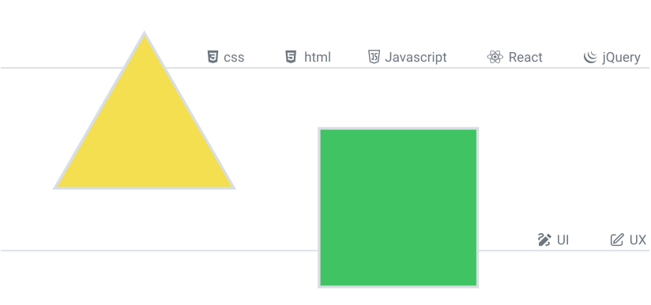
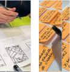

 
 

 

  

 
> I have taken many online courses in front-end development,
> including 200 problem-solving and five mini-projects in the
>  freecodecamp responsive web design course,
> the front-end course at Johns Hopkins University,
> the front-end course at the Quera collection 
> (Iranian Programmers Community), ...
> In addition, I have done projects that 
>  you can see here and on my CodePen page.

     

&nbsp; <a href="https://codepen.io/toghiri">  <a>

  
 

 
> Before entering front-end development, I worked for
>  many years in the field of graphic design and then
>  user experience design. Even now, I design projects
>  that are very important to me or mini experimental projects.
>  I am familiar with Adobe graphic software. However, these days
>  I open less graphic software and design the required works with figma.
>  You can see my portfolio in my accounts on behance and FIGMA sites

     
 

&nbsp;   

   
 
